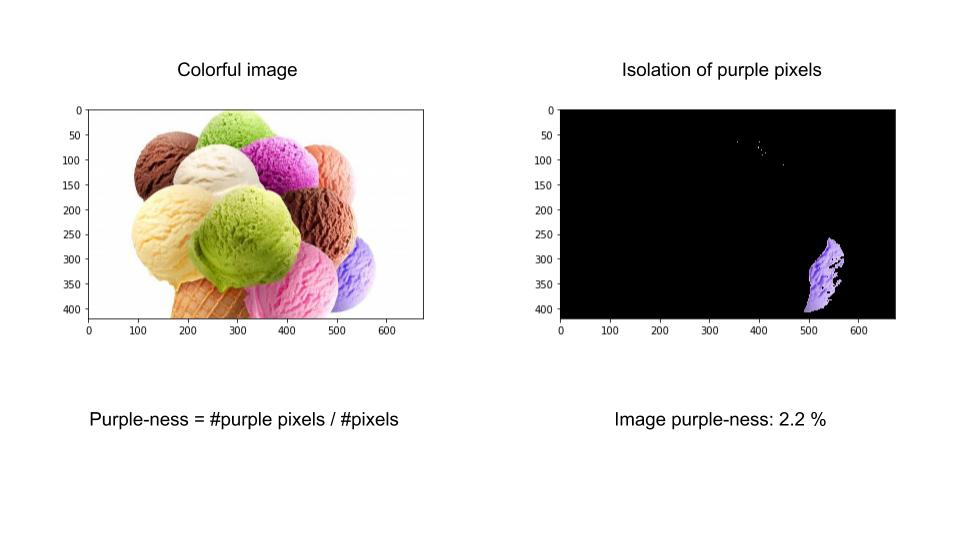

# Image colorness

Let's say you want to analyze first order statistics about your image, such as color.
What is the percentage of green, yellow, blue, red and other hue ranges in your image?

The scripts in this repo compute measures of color-ness in an image according to a specific hue range. 

    

# 1. Conversion from RGB to HSV

The (Hue, Saturation, Value) colorspace is closer to the human representation of hue ranges than RGB [see Medium post about color perception in humans and machines]. 

  image = cv2.cvtColor(image,cv2.COLOR_BGR2HSV

# 2. Hue quantization
We divide the Hue scale in eight bins: red, orange, yellow, green, cyano, blue, purple and magenta. We further quantize the Saturation values to get emasures of white and black. 

  see function: quantize_hue_ranges

# 3. Measuring color-ness as counting
We compute measures of blue-ness, for example, as the frequency of pixels that belong to the quantized hue range for blue in the image. Hence, blue-ness = \# blue pixels / \#pixels

# 4. Colorful-ness measure in terms of opponent color spaces (by Hasler and Süsstrunk)
Their image colorfulness metric is described here:
    https://www.pyimagesearch.com/2017/06/05/computing-image-colorfulness-with-opencv-and-python/ 

